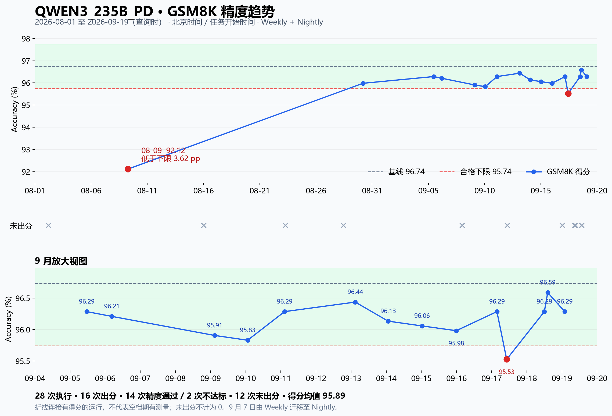

# QWEN3_235B_PD 精度运行统计

范围：北京时间 2026-08-01 00:00 至 2026-09-19 查询时。按 job.started_at 归属日期。
包含 Weekly-A3 与 Nightly-A3 的实际执行及手动触发；排除 skipped 和另一个 _3_5K_1_5k 性能用例。
通过 GitHub Actions API 按周分页列举 816 个 workflow runs（含边界回溯），筛选精确配置名；复查重跑 attempts。
所有 28 条实际执行日志均可取得。原始精确得分来自 AISBench Task 的 accuracy 字段，表格四舍五入至两位。

精度口径为 GSM8K 0-shot CoT / thinking；baseline=96.74，threshold=1，合格闭区间 [95.74,97.74]。
配置迁移与服务设置变化参见 [配置历史核查](config-history.md)。服务版本变化，因此不能视作同一环境的重复测量。

28 次执行，16 次出分：14 次通过、2 次失败；12 次未出分。有效结果通过率 87.5%。均值 95.89，最小 92.12，最大 96.59。
8 月 9 日 92.12 低于下限约 3.62 个百分点；8 月 30 日已恢复为 95.98。9 月 17 日 95.53 再次低于下限约 0.21 个百分点；随后三次恢复至 96.29、96.59、96.29。
全部有效得分均低于基线 96.74。未出分及没有执行的日期不按零分统计，不推断低分原因。

## 全部执行记录

| 开始时间（北京时间） | 工作流 | GSM8K (%) | 精度结果 / 未出分原因 | 测试 ref | GitHub 日志 |
|---|---|---:|---|---|---|
| 08-02 04:31 | Weekly-A3 | — | Prefill 进程就绪前退出 | `5d6ddd906dc1` | [job 91414604420](https://github.com/vllm-project/vllm-ascend/actions/runs/30706604916/job/91414604420) |
| 08-09 06:38 | Weekly-A3 | 92.12 | 不达标 | `d2e818f57229` | [job 93165119539](https://github.com/vllm-project/vllm-ascend/actions/runs/31265243190/job/93165119539) |
| 08-16 00:08 | Weekly-A3 | — | 部署文件 ./lws.yaml 不存在 | `d5e9816065ed` | [job 95036086307](https://github.com/vllm-project/vllm-ascend/actions/runs/31893599009/job/95036086307) |
| 08-23 06:20 | Weekly-A3 | — | Pod 就绪超时（1200 秒） | `182b75ea84ff` | [job 97101945400](https://github.com/vllm-project/vllm-ascend/actions/runs/32582635108/job/97101945400) |
| 08-28 10:38 | Weekly-A3 | — | Pod 就绪超时（1200 秒） | `efe26cd81640` | [job 98737418489](https://github.com/vllm-project/vllm-ascend/actions/runs/33136214842/job/98737418489) |
| 08-30 04:22 | Weekly-A3 | 95.98 | 通过 | `e6a133f710c5` | [job 99155616108](https://github.com/vllm-project/vllm-ascend/actions/runs/33261092260/job/99155616108) |
| 09-05 11:22 | Nightly-A3 | 96.29 | 通过 | `31495777169a` | [job 101240169230](https://github.com/vllm-project/vllm-ascend/actions/runs/33941449988/job/101240169230) |
| 09-06 04:34 | Weekly-A3 | 96.21 | 通过 | `c1bb35f729f2` | [job 101371714716](https://github.com/vllm-project/vllm-ascend/actions/runs/33975742339/job/101371714716) |
| 09-08 00:02 | Nightly-A3 | — | VllmConfig 缺少 _get_v1_model_runner_unsupported_features | `e89f87ddb594` | [job 101803481648](https://github.com/vllm-project/vllm-ascend/actions/runs/34139883239/job/101803481648) |
| 09-09 02:49 | Nightly-A3 | 95.91 | 通过 | `f23a1f2ad6ae` | [job 102193148553](https://github.com/vllm-project/vllm-ascend/actions/runs/34246756642/job/102193148553) |
| 09-10 01:19 | Nightly-A3 | 95.83 | 通过 | `63a9e3290689` | [job 102569399234](https://github.com/vllm-project/vllm-ascend/actions/runs/34372289942/job/102569399234) |
| 09-11 02:32 | Nightly-A3 | 96.29 | 通过 | `c5055c8086d5` | [job 102987563234](https://github.com/vllm-project/vllm-ascend/actions/runs/34497673764/job/102987563234) |
| 09-12 00:00 | Nightly-A3 | — | 部署 YAML 解析错误 | `c843f75aff45` | [job 103329219873](https://github.com/vllm-project/vllm-ascend/actions/runs/34617973934/job/103329219873) |
| 09-13 02:51 | Nightly-A3 | 96.44 | 通过 | `d4d2957e5208` | [job 103603496855](https://github.com/vllm-project/vllm-ascend/actions/runs/34703786018/job/103603496855) |
| 09-14 01:19 | Nightly-A3 | 96.13 | 通过 | `660c4582aa58` | [job 103760995019](https://github.com/vllm-project/vllm-ascend/actions/runs/34766527833/job/103760995019) |
| 09-15 00:24 | Nightly-A3 | 96.06 | 通过 | `26f1363f7180` | [job 104057677643](https://github.com/vllm-project/vllm-ascend/actions/runs/34867803763/job/104057677643) |
| 09-15 23:50 | Nightly-A3 | 95.98 | 通过 | `b49962987e89` | [job 104455637570](https://github.com/vllm-project/vllm-ascend/actions/runs/34990521835/job/104455637570) |
| 09-16 21:40 | Nightly-A3 | — | Prefill 进程就绪前退出 | `ae0186ac97ab` | [job 104818320953](https://github.com/vllm-project/vllm-ascend/actions/runs/35102423958/job/104818320953) |
| 09-16 22:06 | Nightly-A3 | — | Decode ranks 就绪超时 | `0ce574607e68` | [job 104827850294](https://github.com/vllm-project/vllm-ascend/actions/runs/35105630080/job/104827850294) |
| 09-17 03:36 | Nightly-A3 | 96.29 | 通过 | `e1d1490314ee` | [job 104947087614](https://github.com/vllm-project/vllm-ascend/actions/runs/35140918669/job/104947087614) |
| 09-17 10:16 | Nightly-A3 | 95.53 | 不达标 | `7a0aaebca691` | [job 105050823133](https://github.com/vllm-project/vllm-ascend/actions/runs/35173444654/job/105050823133) |
| 09-17 23:51 | Nightly-A3 | — | 运行取消 | `993782efc842` | [job 105275634556](https://github.com/vllm-project/vllm-ascend/actions/runs/35242257526/job/105275634556) |
| 09-18 01:42 | Nightly-A3 | — | AISBench 预热失败：Bad Gateway | `c7ca0b676b96` | [job 105314153314](https://github.com/vllm-project/vllm-ascend/actions/runs/35253856165/job/105314153314) |
| 09-18 12:01 | Nightly-A3 | 96.29 | 通过 | `8f3976a7e70b` | [job 105476130347](https://github.com/vllm-project/vllm-ascend/actions/runs/35305011715/job/105476130347) |
| 09-18 14:17 | Nightly-A3 | 96.59 | 通过 | `bc057b1fdcc6` | [job 105502185402](https://github.com/vllm-project/vllm-ascend/actions/runs/35313847282/job/105502185402) |
| 09-18 14:37 | Nightly-A3 | — | Pod 就绪超时（1201 秒） | `ff7ff67c4da3` | [job 105506552052](https://github.com/vllm-project/vllm-ascend/actions/runs/35315269182/job/105506552052) |
| 09-18 15:16 | Nightly-A3 | — | CircularBufferSpec 导入失败 | `c5c8406fd76a` | [job 105515605423](https://github.com/vllm-project/vllm-ascend/actions/runs/35318196417/job/105515605423) |
| 09-19 01:57 | Nightly-A3 | 96.29 | 通过 | `c8addbb24fe8` | [job 105704758372](https://github.com/vllm-project/vllm-ascend/actions/runs/35376647863/job/105704758372) |

数据： [evidence.json](evidence.json)；绘图脚本：[plot_accuracy.py](plot_accuracy.py)。

## 本地复测

[2026-09-19 本地源码安装轮次：临时精度 94.6728% 与输出异常](local-20260919/README.md)。该轮按用户要求提前停止，非全量最终分数。
